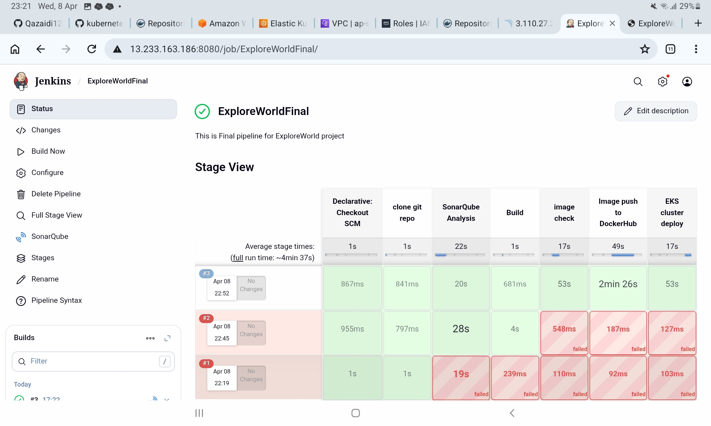

# DevOps Project: Travel Website Deployment

## 1. Project Overview
This project demonstrates end-to-end deployment of a travel website using modern DevOps tools including Git, Ansible, Docker, Jenkins, Kubernetes, and AWS (EC2 & EKS).

## 2. GitHub Repository Structure
kubernetes/
├── Ansible/
│ ├── installation.yaml
│ └── inventory.yaml
├── frontend/
│ ├── Dockerfile
│ ├── index.html
│ ├── script.js
│ └── style.css
├── backend/
│ ├── api.php
│ └── Dockerfile
├── k8s/
│ ├── backend-deployment.yaml
│ ├── backend-service.yaml
│ ├── frontend-deployment.yaml
│ └── frontend-service.yaml
└── Jenkinsfile

---

## 3. Project Flow Architecture

Developer pushes code to GitHub → Jenkins pulls code → Builds Docker images → Pushes images to DockerHub → Deploys to EKS cluster → Website accessible via LoadBalancer

---

## 4. Tools & Technologies Used

- **Git** – Version control  

- **Ansible** – Configuration  
  Ansible is used to install Docker and Kubernetes tools (kubeadm, kubectl, kubelet) and prepare the system by disabling swap and   enabling Docker service.  

- **Docker** – Containerization  
  Frontend and backend applications are containerized using Docker. Apache server with PHP is used. Code is copied into `/var/www/html` and exposed on port 80.  

- **Jenkins** – Run CI/CD pipeline  

- **Kubernetes** – Container orchestration: Frontend and backend are deployed using Kubernetes Deployments.  
    - Frontend → LoadBalancer  
    - Backend → ClusterIP  

- **AWS EC2** – Virtual servers  

- **AWS EKS** – Managed Kubernetes cluster  

---

## 5. Jenkins CI/CD Pipeline: Pipeline stages include:

1. Clone Git repository  
2. SonarQube code analysis  
3. Docker image build  
4. Security scans using Trivy  
5. Push images to DockerHub  
6. Deploy to AWS EKS cluster  
7. Perform rolling updates  

---

## 6. Screenshots

- Jenkins Pipeline
- 
- Kubernetes Pods and Services  
- AWS EKS Cluster  
- Website Output  
- DockerHub Images  

---

### 7. Challenges and Solutions

# 1. SonarQube Analysis Issue
**Error:** Failed to query server version: HTTP connect timed out  

**Solution:**  
Manage Jenkins → System → SonarQube Installation → Update URL  

Since EC2 public IP changes (no Elastic IP), update URL: http://<public-ip>:9000

# 2. Trivy Not Found
**Error:** trivy: not found  

**Solution:**  
Installed Trivy using official documentation: https://trivy.dev/  

# 3. Kubectl Configuration Issue
**Error:**  
The connection to the server 127.0.0.1:34897 was refused  

**Reason:**  
kubectl was not connected to EKS cluster (missing kubeconfig)

**Solution:** command: aws eks --region ap-south-1 update-kubeconfig --name ekscluster
Then verify: "kubectl get pods" & "kubectl get svc"

---

## 8. Conclusion

This project demonstrates a complete DevOps lifecycle including CI/CD, containerization, orchestration, and deployment on AWS cloud.

## 9. GitHub Repository:   https://github.com/Qazaidi123/ExploreWorldFinal

